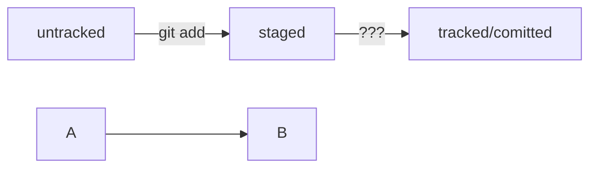

# Шпаргалка по Git

## Основные понятия

1. **Репозиторий** – хранилище кода и истории изменений.
2. **Коммит** – фиксация изменений в репозитории.
3. **Ветка (branch)** – изолированная линия разработки.
4. **GitHub** – платформа для хостинга Git-репозиториев.
5. **Клонирование (clone)** – копирование удаленного репозитория на ПК.

## Основные команды

```bash
git init                     # Инициализация репозитория
git add <файл>               # Добавление файла в индекс
git commit -m "Сообщение"    # Создание коммита
git status                   # Просмотр изменений
git log                      # История коммитов
git push origin main         # Отправка изменений на GitHub
git pull                     # Загрузка изменений с сервера
git clone <URL>              # Клонирование репозитория
```

## Инициализация репозитория

1. Откройте терминал в папке проекта.

2. Выполните:

```bash
git init
git add .
git commit -m "Первый коммит"
```

## Регистрация на GitHub

1. Перейдите на [GitHub](github.com).

2. Нажмите Sign Up, заполните данные.

3. Создайте новый репозиторий (кнопка + → New repository).

4. Следуйте инструкциям для связки с локальным репозиторием.

## Работа с коммитами

* Добавить изменения: ```git add``` . (все файлы) или ```git add <файл>```

* Закоммитить: ```git commit -m "Описание изменений"```

* Отправить на GitHub: ```git push origin main``` (или имя вашей ветки)

## Хеш коммита

- Уникальный SHA-1 идентификатор (например, `a1b2c3d...`), который:
  - Генерируется автоматически для каждого коммита
  - Используется для ссылки на коммит в командах:
  
    ```bash
    git show a1b2c3d
    git checkout a1b2c3d  # Переход к конкретному коммиту
    ```
	
## Указатель HEAD

- Указатель на текущий коммит или ветку:
  - `HEAD~1` — предыдущий коммит
  - `HEAD~3` — три коммита назад
  - Пример:
  
    ```bash
    git diff HEAD~1..HEAD  # Сравнить изменения последнего коммита
    ```
	
## Статусы файлов

- **Untracked** — файл не добавлен в Git
- **Modified** — файл изменен, но не проиндексирован
- **Staged** — файл добавлен в индекс (`git add`)
- **Committed** — изменения зафиксированы
- **Tracked** - файл отслеживается Git, все staged файлы являются tracked



## 📜 Лог коммитов

```bash
git log                      # Базовая история
git log --oneline            # Краткий формат (хеш + сообщение)
git log -p                   # С изменениями (diff)
git log --graph --all        # Визуализация веток
git log --since="2 days ago" # Фильтр по времени
```

## Стили сообщений к коммитам

### 1. Корпоративный
В корпоративном стиле в начале сообщения обычно указывают Jira-ID, а после — текст сообщения.

```bash
$ git commit -m "LGS-239: Дополнить список пасхалок новыми числами"
```

### 2. Conventional Commits
Conventional Commits предлагает такой формат коммита: <type>: <сообщение>. Первая часть type — это тип изменений.

```bash
feat(login): add password reset button
fix(api): handle null response
docs: update README.md
```

### 3. GitHub-стиль
Если коммит «закрывает» или «решает» какую-то задачу, то в его сообщении удобно указывать ссылку на неё. Для этого в любом месте сообщения нужно указать #<номер задачи>.

```bash
$ git commit -m "Исправить #334, добавить график температуры"
```
